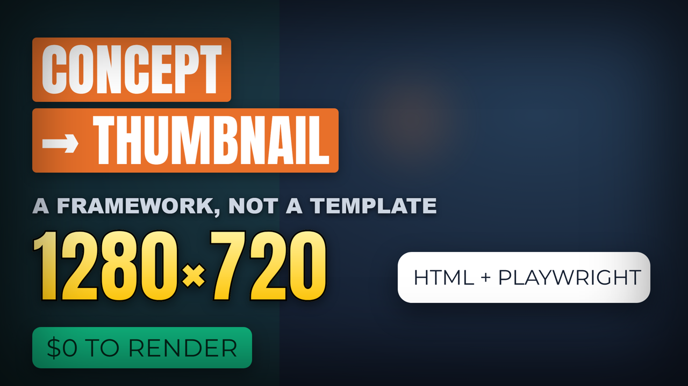

# render-thumbnail — a Claude Code skill

Turn a thumbnail **concept** into an actual **1280×720 PNG** — a big cinematic face, one real
proof element, and a non-flat background — rendered with HTML/CSS + Playwright (zero cost for
the composite).

It's a **framework, not a template**: a decision process that produces *varied* thumbnails
sharing one brand DNA, instead of one layout you re-skin. The whole thing starts at
[`skills/render-thumbnail/thumbnail-framework.md`](skills/render-thumbnail/thumbnail-framework.md).



*(Engine demo — highlight boxes, gradient text, card, pill, color zones, vignette. In a real
thumbnail a big cinematic face cut-out sits on top; see the framework's Step 2.)*

## What's in the box

- **`render_html.py` + `html_template.html`** — the layered compositor. Config-driven: background
  (gradient / real screenshot / AI scene / color zones) + big face + highlight/gradient/card/pill
  text + vignette. Local images and fonts are inlined so it renders from a `file://` page.
- **Face pipeline** — `prep_face.py` (rembg cut-out → autocrop → cinematic grade → baked white
  outline), `face_autocrop.py` (OpenCV big-face crop), `face_polish.py` (grade + outline).
- **`gen_background.py`** — optional AI themed backgrounds via OpenAI `gpt-image-1` (backgrounds
  only, never the face). Needs `OPENAI_API_KEY`.

## Install

```bash
# project-level
mkdir -p .claude/skills && cp -r skills/render-thumbnail .claude/skills/
# or user-level
cp -r skills/render-thumbnail ~/.claude/skills/
```

Then install the runtime deps:

```bash
pip install playwright pillow rembg opencv-python openai && playwright install chromium
```

(`openai` is only needed for AI backgrounds — Mode C.)

## Use it

Read the framework, lock a concept brief, then:

```bash
# 1. cut the face out (rembg)
python -c "from rembg import remove,new_session;from PIL import Image;\
open('cut.png','wb').write(remove(open('photo.jpg','rb').read(),session=new_session('u2net'),alpha_matting=True))"
# 2. face -> ready-to-place portrait
python prep_face.py cut.png faces/v1.png 14
# 3. (optional) AI background
OPENAI_API_KEY=sk-... python gen_background.py "stacks of cash in a dark office" bg.png low
# 4. author <video>.json (schema in the framework doc) and render
python render_html.py video.json    # -> video.png + video.m120.png
```

The `.m120.png` is the 120px mobile-size gate — if it doesn't read in under a second, the
concept isn't done.

## Reuse beyond YouTube

The HTML engine is a generic layered canvas — change `width`/`height` for X-post cards
(1200×675) or video frames (1920×1080).

## Fonts

Bundled fonts (Anton, Montserrat) are licensed under the SIL Open Font License — see
[`skills/render-thumbnail/assets/FONTS.md`](skills/render-thumbnail/assets/FONTS.md).

## License

MIT (code) — see [LICENSE](LICENSE). Fonts under OFL as noted above.
